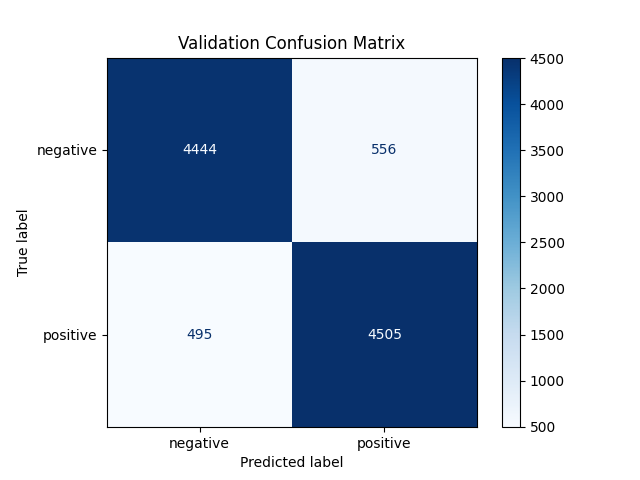
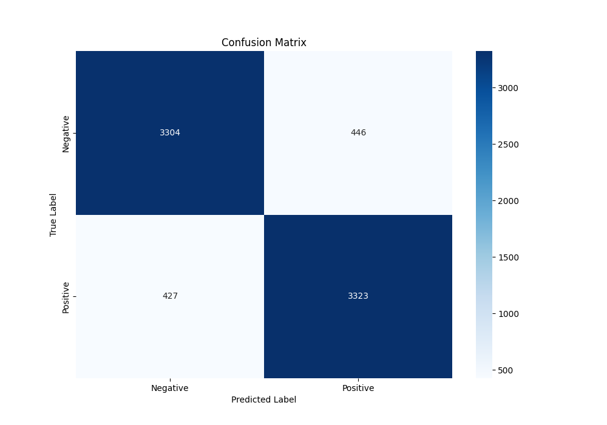

# Sentiment Analysis Project

This project is a **Sentiment Analysis** pipeline built using **Python** and **PyTorch**.  
It includes:

- Preprocessing text data
- Tokenization and padding
- Word embeddings using **GloVe**
- LSTM-based model for sentiment classification
- Evaluation metrics and visualization plots

The goal of this project is to classify text as **positive** or **negative** based on the dataset.  

## Features

- Uses pretrained word embeddings (GloVe) for better performance.
- Modular Python code for easy understanding and maintenance.
- Generates plots for training/validation accuracy, loss, and confusion matrix.

## Table of contents

1. [Preprocessing](#preprocessing)
2. [Baseline Models](#baseline-models)
    - [Baseline 0: Logistic Regression](#baseline-0-logistic-regression)
    - [Baseline 1: LSTM](#baseline-1-lstm)
    - [Baseline 2: GRU](#baseline-2-gru)
    - [Baseline 3: LSTM&Glove](#baseline-3-LSTM&Glove)
### preprocessing

The preprocessing module (`processing.py`) contains all necessary steps before training the models:

1. **process_**
   - Cleans raw text (removes punctuation, digits, extra spaces, lowercase).

2. **tockenize**
   - Tokenizes text into words, removes stopwords, encodes words to integers, and splits data into train/val/test sets.

3. **padding**
   - Pads sequences to a fixed length (e.g., 100) for uniform input to models.

4. **buile_embedding_matrix**
   - Loads pretrained GloVe embeddings and maps words in the vocabulary to their vector representations.
   - Words not in GloVe are initialized randomly.

  ### Baseline 0: Logistic Regression

This is the first baseline model using **Logistic Regression** with TF-IDF features.

**Steps:**
1. **Vectorization:** Convert text to TF-IDF numerical features using `TfidfVectorizer`.
2. **Training:** Train Logistic Regression on training set.
3. **Prediction:** Predict labels on training and validation sets.
4. **Evaluation:** Compute metrics including:
   - **Accuracy**
 #### Training & Validation Accuracy

| Dataset    | Accuracy |
|-----------|----------|
| Training  |  0.91     |
| Validation| 0.89    |
   - **Classification report** (precision, recall, F1-score)
     #### Classification Report (Validation)

| Class           | Precision | Recall | F1-score | Support |
|-----------------|-----------|--------|----------|---------|
| 0 (Negative)    | 0.90      | 0.89   | 0.89     | 5000    |
| 1 (Positive)    | 0.89      | 0.90   | 0.90     | 5000    |
| **Accuracy**    | -         | -      | 0.89     | 10000   |
| **Macro avg**   | 0.89      | 0.89   | 0.89     | 10000   |
| **Weighted avg**| 0.89      | 0.89   | 0.89     | 10000   |

   - **Confusion matrix**
     

### Baseline 1: LSTM

This baseline model uses a **Two LSTM** for sentiment analysis.  
It processes sequences of word indices (encoded sentences) and learns patterns over time to classify sentiment.

**Model Architecture:**
- **Embedding Layer:** Converts word indices to dense vectors.
- **LSTM Layer:** Learns sequential patterns in the text.
- **Dropout Layer:** Prevents overfitting.
- **Fully Connected Layer:** Maps hidden state to output dimension.
- **Sigmoid Activation:** Outputs probabilities for binary classification.
  #### Accuracy

| Dataset    | Accuracy |
|-----------|----------|
| Training  | 0.9015   |
| Validation| 0.8788   |
| Test      | 0.8836   |
#### Test Classification Report

| Class           | Precision | Recall | F1-score | Support |
|-----------------|-----------|--------|----------|---------|
| 0 (Negative)    | 0.89      | 0.88   | 0.88     | 3750    |
| 1 (Positive)    | 0.88      | 0.89   | 0.88     | 3750    |
| **Accuracy**    | -         | -      | 0.88     | 7500    |
| **Macro avg**   | 0.88      | 0.88   | 0.88     | 7500    |
| **Weighted avg**| 0.88      | 0.88   | 0.88     | 7500    |

**Test Confusion Matrix Placeholder:**

### Training & Validation Curves

During training, we monitored **training and validation loss and accuracy**.  
I also used an **Early Stopping** mechanism based on **validation accuracy** to prevent overfitting.

  

  
      

