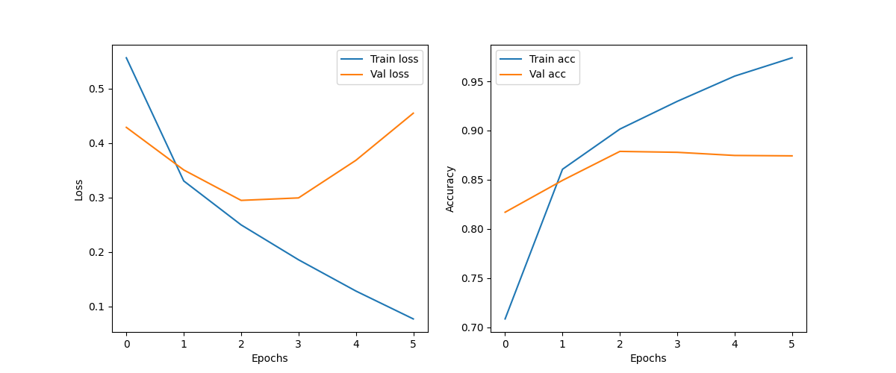
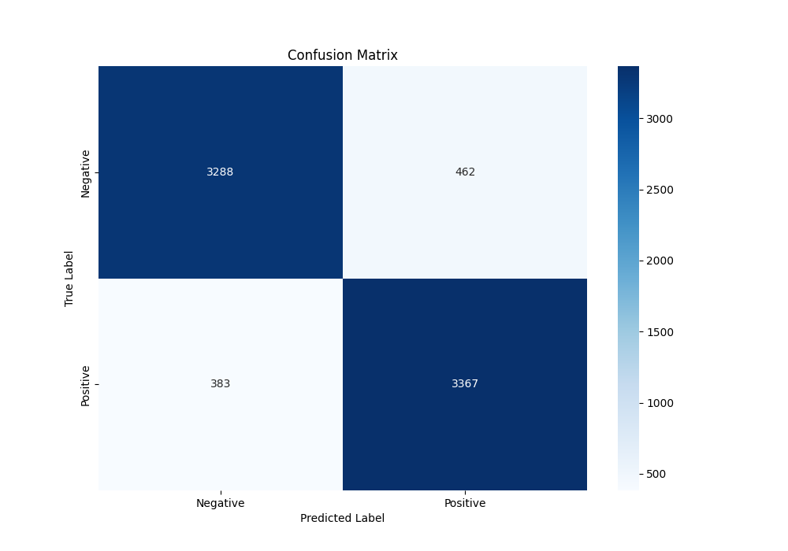
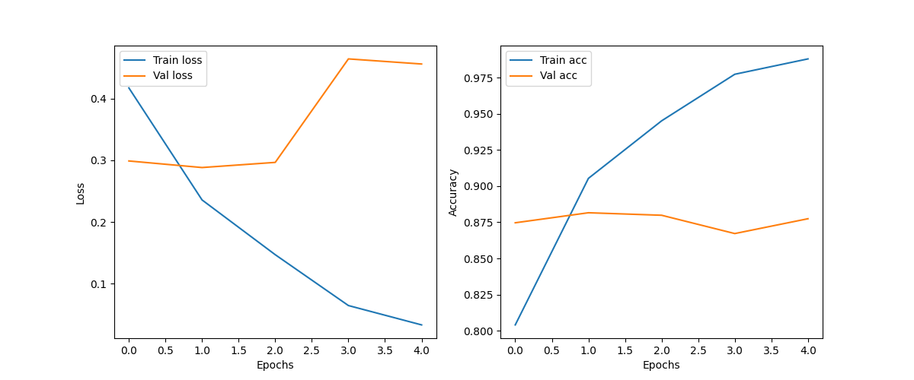
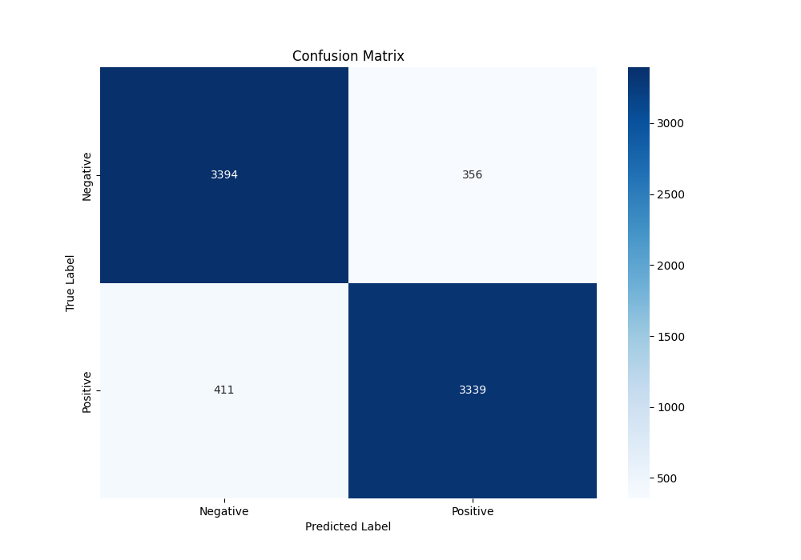
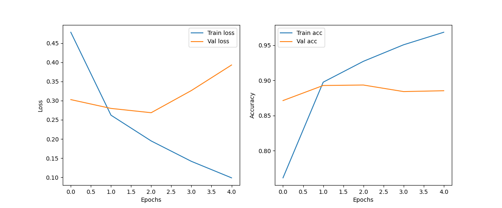

# Sentiment Analysis Project

This project implements a **Sentiment Analysis** pipeline using **Python**, **PyTorch**, and classical ML techniques.  
We use the **[IMDB Movie Reviews Dataset](https://www.kaggle.com/datasets/lakshmi25npathi/imdb-dataset-of-50k-movie-reviews)** to classify reviews as **positive** or **negative**.

---

## Features

- Preprocessing text data (cleaning, tokenization, padding)
- Word embeddings using **GloVe 300d**
- Baseline models: Logistic Regression, LSTM, GRU, LSTM + Word2Vec
- Evaluation metrics: Accuracy, Precision, Recall, F1-score, Confusion Matrix
- Training/validation plots and Early Stopping based on validation accuracy
- Modular code for reproducibility and ease of understanding

---

## Table of Contents

1. [Preprocessing](#preprocessing)
2. [Baseline Models](#baseline-models)
   - [Baseline 0: Logistic Regression](#baseline-0-logistic-regression)
   - [Baseline 1: LSTM](#baseline-1-lstm)
   - [Baseline 2: GRU](#baseline-2-gru)
   - [Baseline 3: LSTM + Word2Vec / GloVe 300d](#baseline-3-lstm-word2vec-glove-300d)
3. [Comparison Between Baselines](#comparison-between-baselines)

---

## Preprocessing

The `processing.py` module performs all preprocessing steps before training:

1. **process_**: Cleans raw text (removes punctuation, digits, extra spaces, converts to lowercase).  
2. **tockenize**: Tokenizes text, removes stopwords, encodes words to integers, and splits data into train/val/test sets.  
3. **padding**: Pads sequences to a fixed length (e.g., 100) for uniform input.  
4. **build_embedding_matrix**: Loads **GloVe 300d** embeddings, mapping words in the vocabulary to vectors. Words not in GloVe are randomly initialized.  

---

## Baseline Models

### Baseline 0: Logistic Regression

- Uses **TF-IDF** features.
- Trains a simple Logistic Regression model for sentiment classification.
- Evaluates using accuracy and classification report.

#### Accuracy

| Dataset    | Accuracy |
|-----------|----------|
| Training  | 0.91     |
| Validation| 0.89     |

#### Validation Classification Report

| Class           | Precision | Recall | F1-score | Support |
|-----------------|-----------|--------|----------|---------|
| 0 (Negative)    | 0.90      | 0.89   | 0.89     | 5000    |
| 1 (Positive)    | 0.89      | 0.90   | 0.90     | 5000    |
| **Accuracy**    | -         | -      | 0.89     | 10000   |
| **Macro avg**   | 0.89      | 0.89   | 0.89     | 10000   |
| **Weighted avg**| 0.89      | 0.89   | 0.89     | 10000   |

**Confusion Matrix:**


---

### Baseline 1: LSTM

- Uses a **two-layer LSTM** for sentiment classification.
- Learns sequential patterns in word indices.
- Early Stopping applied based on **validation accuracy**.

#### Accuracy

| Dataset    | Accuracy |
|-----------|----------|
| Training  | 0.9015   |
| Validation| 0.8788   |
| Test      | 0.8836   |

#### Test Classification Report

| Class           | Precision | Recall | F1-score | Support |
|-----------------|-----------|--------|----------|---------|
| 0 (Negative)    | 0.89      | 0.88   | 0.88     | 3750    |
| 1 (Positive)    | 0.88      | 0.89   | 0.88     | 3750    |
| **Accuracy**    | -         | -      | 0.88     | 7500    |
| **Macro avg**   | 0.88      | 0.88   | 0.88     | 7500    |
| **Weighted avg**| 0.88      | 0.88   | 0.88     | 7500    |

**Confusion Matrix Placeholder:**


**Training & Validation Curves:**



---

### Baseline 2: GRU

- Uses a **GRU**, capturing sequential patterns like LSTM but with fewer parameters.

#### Accuracy

| Dataset    | Accuracy |
|-----------|----------|
| Training  | 0.9054   |
| Validation| 0.8816   |
| Test      | 0.8873   |

#### Test Classification Report

| Class           | Precision | Recall | F1-score | Support |
|-----------------|-----------|--------|----------|---------|
| 0 (Negative)    | 0.90      | 0.88   | 0.89     | 3750    |
| 1 (Positive)    | 0.88      | 0.90   | 0.89     | 3750    |
| **Accuracy**    | -         | -      | 0.89     | 7500    |
| **Macro avg**   | 0.89      | 0.89   | 0.89     | 7500    |
| **Weighted avg**| 0.89      | 0.89   | 0.89     | 7500    |

**Confusion Matrix Placeholder:**



**Training & Validation Curves:**



---

### Baseline 3: LSTM + Word2Vec / GloVe 300d

- Uses a **LSTM** with **pretrained Word2Vec / GloVe 300d embeddings** for better word representations.

#### Accuracy

| Dataset    | Accuracy |
|-----------|----------|
| Training  | 0.9272   |
| Validation| 0.8935   |
| Test      | 0.8977   |

#### Test Classification Report

| Class           | Precision | Recall | F1-score | Support |
|-----------------|-----------|--------|----------|---------|
| 0 (Negative)    | 0.89      | 0.91   | 0.90     | 3750    |
| 1 (Positive)    | 0.90      | 0.89   | 0.90     | 3750    |
| **Accuracy**    | -         | -      | 0.90     | 7500    |
| **Macro avg**   | 0.90      | 0.90   | 0.90     | 7500    |
| **Weighted avg**| 0.90      | 0.90   | 0.90     | 7500    |

**Confusion Matrix Placeholder:**



**Training & Validation Curves:**



Early stopping applied based on **validation accuracy**.

---

## Comparison Between Baselines

| Baseline | Model Type          | Training Accuracy | Validation Accuracy | Test Accuracy |
|----------|------------------|-----------------|-------------------|---------------|
| 0        | Logistic Regression| 0.91             | 0.89              | 0.89          |
| 1        | LSTM               | 0.9015           | 0.8788            | 0.8836        |
| 2        | GRU                | 0.9054           | 0.8816            | 0.8873        |
| 3        | LSTM + Word2Vec / GloVe 300d | 0.9272   | 0.8935            | 0.8977        |

---

**Notes:**

- Early stopping is applied to all neural models based on **validation accuracy** to prevent overfitting.  
- Pretrained embeddings improve model generalization and speed up convergence.
  
## Future Work
In future iterations, this project can be enhanced using advanced techniques such as:

1. **Ensemble Methods** – Combining predictions from multiple models (Logistic Regression, LSTM, GRU, LSTM+GloVe) to improve overall accuracy and robustness.  
2. **Hyperparameter Optimization** – Using techniques like Grid Search, Random Search, or Bayesian Optimization to find the best model parameters.  
3. **Advanced NLP Techniques** – Incorporating modern architectures such as Transformers, BERT, or GPT-based models for better contextual understanding and sentiment classification.

## Installation & Setup

Follow these steps to set up and run the project locally:

1. **Clone the repository:**

```bash
git clone https://github.com/your-username/simple_sentiment-analysis.git
cd simple_sentiment-analysis
python -m venv venv
venv\Scripts\activate
2.**Create and activate a virtual environment:**
  -windows
python -m venv venv
venv\Scripts\activate
-Mac/Linux:
python -m venv venv
source venv/bin/activate
3-**Install dependencies:**
pip install -r requirements.txt
4-**Download GloVe embeddings:**

Visit GloVe website

Download glove.6B.zip and extract glove.6B.300d.txt into data/.

5-**Download IMDb Dataset (Kaggle):**
Place dataset files in data/.
6-Run the project:
python main.py


